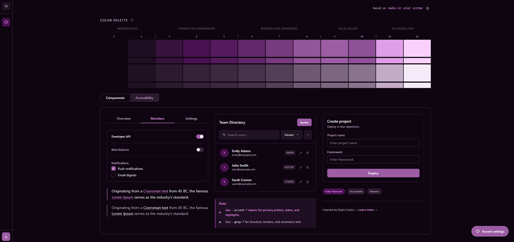
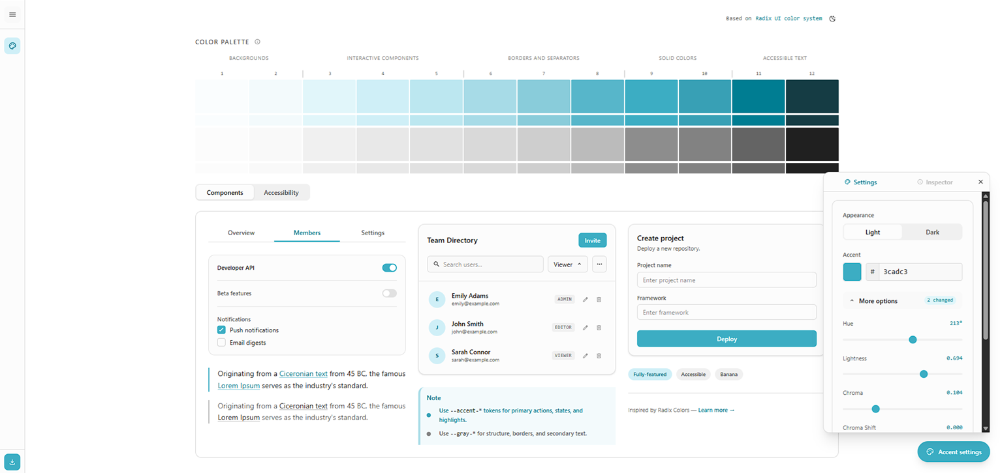
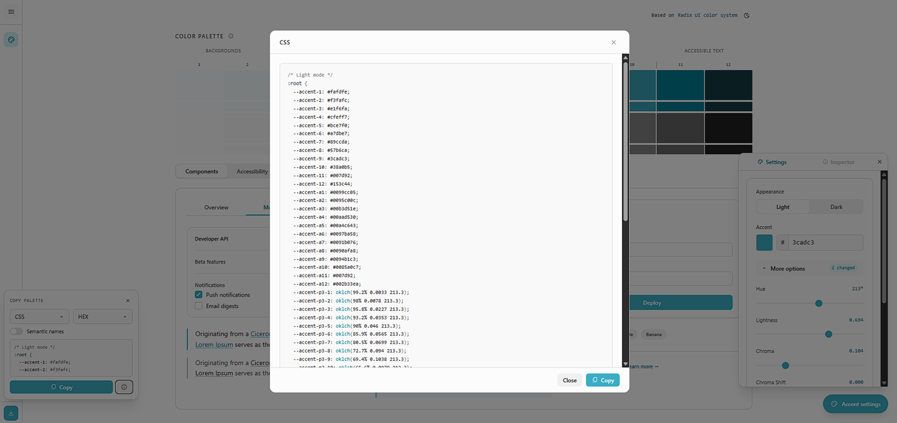

# Radix Palette Generator

This is Radix propaganda ツ.

I liked Radix's design system, it is a 12 step color scale (accent and gray) that groups the different UI functionalities like backgrounds, interactive components, borders, accents, and accessible text. [Radix already has a custom palette generator](https://www.radix-ui.com/colors/custom), but I wanted to add more customization to the accent value (hue, chroma, lightness) directly, and be able to edit values of the generated scale individually to see how it affects the components.

I also wanted to allow exporting the palette in different formats (CSS, TailwindCSS, etc.) and color types (hex, rgb, oklch, etc.), with some options like semantic names.

## How it works

A custom Radix Colors palette generator built with React, TypeScript, and TailwindCSS v4. It takes an accent color, gray color, and background color, and generates the full 12-step Radix color scale using the algorithm from [radix-ui/colors](https://radix-ui.com/colors).

## Step usage reference

| Group                  | Step | Use case                                |
| ---------------------- | ---- | --------------------------------------- |
| Background             | 1    | App background                          |
| Background             | 2    | Subtle background                       |
| Interactive Components | 3    | UI element background (normal state)    |
| Interactive Components | 4    | Hovered UI element background           |
| Interactive Components | 5    | Active / Selected UI element background |
| Borders and separators | 6    | Subtle borders and separators           |
| Borders and separators | 7    | UI element border and focus rings       |
| Borders and separators | 8    | Hovered UI element border               |
| Solid colors           | 9    | Solid backgrounds                       |
| Solid colors           | 10   | Hovered solid backgrounds               |
| Accessible text        | 11   | Low contrast text                       |
| Accessible text        | 12   | High contrast text                      |

## [Preview](https://alexbgh1.github.io/palette-ui/)







### Implemented

- **Full 12 step accent scale** with alpha and wide gamut (Display P3)
- **Full 12 step gray scale** with alpha and wide gamut (Display P3)
- **Light/Dark mode** palette generation
- **Exports** CSS, Sass, Tailwind v3, Tailwind v4, JSON, JS / TS
- **Color formats**: HEX, RGB, HSL, OKLCH
- **Raw format** e.g. `rgb(255, 255, 255)` vs `255 255 255)`
- **Semantic names** for each step (e.g., `--accent-1` vs `--bg-subtle`)

## Dependencies

- `colorjs.io` — OKLCH conversion, deltaEOK, APCA contrast, interpolation
- `@radix-ui/colors` — reference scale data (23 scales × 12 steps, light + dark P3) -> used for generating the accent and gray scales
- `bezier-easing` — Bézier easing for `transposeProgressionStart`
- TailwindCSS v4 — via `@tailwindcss/vite` plugin

## Development

```bash
npm install
npm run dev
npm run build
```

## TODO:

- [ ] Fix export Tailwind v3 and v4 (alphas): Right now it doesn't make sense
- [ ] Fix export tests based on previous task
- [ ] Github Actions to deploy to Github Pages
